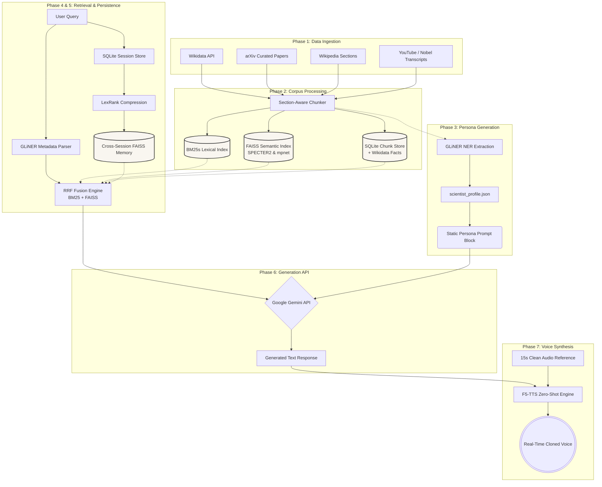

# Scientist Digital Twin

A retrieval-augmented AI persona system that simulates any notable scientist using only non-LLM components for all extraction, retrieval, and memory — and exactly one LLM call for generation.

> **Target scientist (default): Richard Feynman.** Swap `wikidata_qid`, `semantic_scholar_id`, and `wikipedia_title` in `config/scientist.yaml` for any other scientist. Note: For Richard Feynman, we bypass Semantic Scholar to avoid data contamination and instead use a curated list of his historically authentic, verified arXiv papers (e.g. 1947 Letter on Path Integrals).

---

## Architecture Overview



**Core design principle:** No LLM is used anywhere except the final generation API call. All extraction (GLiNER), retrieval (BM25s + FAISS), compression (LexRank), and metadata (GLiNER query parser) are local non-LLM models.

---

## Quick Start

### 1. Install dependencies

```bash
pip install -r requirements.txt
python -m nltk.downloader punkt
```

### 2. Set your API key

```bash
export GEMINI_API_KEY=your-gemini-key
```

### 3. Configure the scientist

Edit `config/scientist.yaml`:
```yaml
scientist:
  name: "Richard Feynman"
  wikidata_qid: "Q39246"
  semantic_scholar_id: "1868127"
  wikipedia_title: "Richard Feynman"
  youtube_video_ids:
    - "7YL5oUNBJvs"
    - "ZzVHDkjMjk"
    - "4zZbX9i3WA"
```

### 4. Initialize project structure

```bash
python src/init_project.py
```

### 5. Run the full pipeline

```bash
python run_pipeline.py --phase all
```

Or run individual phases:
```bash
python run_pipeline.py --phase ingestion   # Fetch all data sources
python run_pipeline.py --phase processing  # Chunk + index
python run_pipeline.py --phase profile     # Extract scientist profile
```

### 6. Chat

```bash
python run_pipeline.py --chat

# Or single query:
python src/generation/generate.py --query "What is the path integral?"
```

---

## Project Structure

```
scientisttwin/
├── config/
│   └── scientist.yaml          # Scientist configuration
├── data/
│   ├── raw/
│   │   ├── papers/             # Downloaded PDFs + extracted text
│   │   ├── transcripts/        # YouTube, Wikipedia, Nobel lecture
│   │   └── audio/              # Reference audio + segments
│   ├── processed/
│   │   ├── all_chunks.json     # All chunked text
│   │   ├── chunks.db           # SQLite: chunks + Wikidata facts
│   │   ├── scientist_wikidata.json
│   │   ├── scientist_profile.json      # Final persona artifact
│   │   └── persona_prompt_block.txt    # Static system prompt block
│   ├── indices/
│   │   ├── bm25_index/         # BM25s index
│   │   └── faiss_hnsw.index    # FAISS HNSW index
│   └── sessions/
│       └── sessions.db         # SQLite: turns + session summaries
├── src/
│   ├── ingestion/              # Phase 1: data fetchers
│   ├── processing/             # Phase 2+3: chunking, indexing, profile
│   ├── retrieval/              # Phase 4: RRF retrieval engine
│   ├── persistence/            # Phase 5: metadata, sessions, compression
│   ├── generation/             # Phase 6: context assembly + Anthropic call
│   └── voice/                  # Phase 7: VibeVoice fine-tune + synthesis
├── evals/
│   ├── eval_retrieval.py       # Topic recall eval
│   └── eval_generation.py      # BERTScore faithfulness eval
├── run_pipeline.py             # Full pipeline runner
├── requirements.txt
└── .env.example
```

---

## Phase-by-Phase Reference

### Phase 1: Data Ingestion

| Script | What it does |
|--------|-------------|
| `fetch_wikidata.py` | Fetches full entity JSON from Wikidata, resolves QID labels |
| `fetch_semantic_scholar.py` | Fetches all papers, downloads open-access PDFs |
| `fetch_wikipedia.py` | Extracts full Wikipedia article by section |
| `fetch_youtube_transcripts.py` | Downloads and segments YouTube transcripts |
| `fetch_supplementary.py` | Nobel lecture HTML, arXiv papers, open-access URLs |

### Phase 2: Corpus Processing

| Script | What it does |
|--------|-------------|
| `chunker.py` | Section-aware chunking for papers; semantic for transcripts |
| `build_bm25_index.py` | BM25s index over all chunks |
| `build_faiss_index.py` | FAISS HNSW with SPECTER2 (papers) + mpnet (transcripts) |
| `chunk_store.py` | SQLite master record for all chunks + Wikidata facts |

### Phase 3: Scientist Profile

| Script | What it does |
|--------|-------------|
| `build_scientist_profile.py` | GLiNER extraction over full corpus |
| `merge_scientist_profile.py` | Merges Wikidata + GLiNER + manifest → final profile |

### Phase 4: Retrieval

| Module | What it does |
|--------|-------------|
| `retrieval_engine.py` | BM25 + FAISS + RRF fusion + Wikidata context injection |

### Phase 5: Persistence

| Module | What it does |
|--------|-------------|
| `metadata_extractor.py` | GLiNER-based query metadata extraction |
| `session_store.py` | SQLite session/turn store |
| `session_compressor.py` | LexRank compression + cross-session FAISS retrieval |

### Phase 6: Generation

| Module | What it does |
|--------|-------------|
| `context_assembler.py` | Assembles system prompt + user message with truncation |
| `generate.py` | **Only LLM call** — Google Gemini API |

### Phase 7: Voice (Optional)

| Script | What it does |
|--------|-------------|
| `prepare_voice_data.py` | yt-dlp download + Whisper alignment + segment extraction |
| `synthesize.py` | Real-time zero-shot synthesis via F5-TTS |

---

## Swapping Scientists

To use a different scientist (e.g. Marie Curie):

1. Find their Wikidata QID at [wikidata.org](https://wikidata.org) — e.g. `Q7186`
2. Find their Semantic Scholar author ID at [semanticscholar.org](https://semanticscholar.org)
3. Edit `config/scientist.yaml`:
   ```yaml
   scientist:
     name: "Marie Curie"
     wikidata_qid: "Q7186"
     semantic_scholar_id: "THEIR_SS_ID"
     wikipedia_title: "Marie Curie"
     youtube_video_ids: []
     nobel_lecture_url: "https://www.nobelprize.org/prizes/physics/1903/marie-curie/lecture/"
   ```
4. Re-run the full pipeline: `python run_pipeline.py --phase all`

---

## Hardware Requirements

| Task | Minimum VRAM | Recommended |
|------|-------------|-------------|
| BM25 indexing | CPU only | CPU |
| FAISS indexing (SPECTER2 + mpnet) | 4GB GPU or CPU | 8GB GPU |
| GLiNER profile extraction | CPU (slow) or 4GB GPU | 8GB GPU |
| Generation (API call) | No GPU | No GPU |
| F5-TTS zero-shot synthesis | 8GB VRAM | 12GB VRAM |

---

## Evaluation

```bash
# Retrieval quality (topic recall)
python evals/eval_retrieval.py

# Generation faithfulness (BERTScore)
# Requires GEMINI_API_KEY + bert-score installed
python evals/eval_generation.py
```

---

## Known Limitations

- **Semantic Scholar disambiguation**: For common names, verify the correct `semantic_scholar_id` manually before running ingestion.
- **Voice audio quality**: The zero-shot F5-TTS model requires exactly one clean 15-second reference clip. If the Cornell 1964 Messenger Lectures have low SNR, use a cleaner studio recording for the reference.
- **No hallucination guardrail**: If a query falls completely outside the retrieved context, the model may hedge but may also confabulate. Evaluating BERTScore against retrieved chunks at inference time is a recommended future addition.

---

## License

Research use. All third-party data sources (Wikidata, Semantic Scholar, Wikipedia, Nobel Prize) are used under their respective open licenses. F5-TTS is MIT-licensed.
