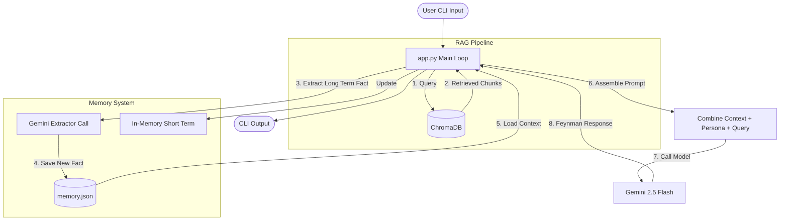

# Architecture Diagram

This diagram explains the core logic of the Richard Feynman Digital Twin.

## Data Flow
1. User types a question in the CLI.
2. The `RAGPipeline` queries `ChromaDB` against the local corpus for relevant Feynman quotes or ideas.
3. The `MemoryManager` uses a background Gemini call to extract new long-term facts about the user.
4. The `MemoryManager` supplies previous conversation history (short-term) and accumulated facts (long-term).
5. All elements (system prompt, RAG chunks, memory, user query) are fed to **Gemini 2.5 Flash**.
6. Gemini responds as Richard Feynman.
